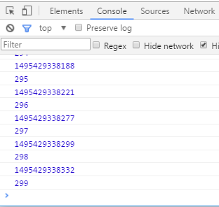

函数节流(throttle)
---
参考
http://www.cnblogs.com/dolphinX/p/3403821.html
http://www.alloyteam.com/2012/11/javascript-throttle/
### 1. 背景
介绍前，先说下背景。在前端开发中，有时会为页面绑定resize事件，或者为一个页面元素绑定拖拽事件（其核心就是绑定mousemove），这种事件有一个特点，就是用户不必特地捣乱，他在一个正常的操作中，都有可能在一个短的时间内触发非常多次事件绑定程序。而大家知道，DOM操作时很消耗性能的，这个时候，如果你为这些事件绑定一些操作DOM节点的操作的话，那就会引发大量的计算，在用户看来，页面可能就一时间没有响应，这个页面一下子变卡了变慢了。甚至在IE下，如果你绑定的resize事件进行较多DOM操作，其高频率可能直接就使得浏览器崩溃。

- 当浏览器窗口改变的时候，我们在控制台输出距离1970.1.1的毫秒数
```html
<html>
<head>
    <title></title>
</head>
<body>
	<h3>当窗口发生变化的时候，我们获取当前距离1970.1.1日的毫秒数</h3>
    <script type="text/javascript">
        n=0;
        function resizehandler(){
            console.log(new Date().getTime());
            console.log(++n);
        }

        window.onresize=resizehandler;
    </script>
</body>
</html>
```
功能倒是实现了，但是我拖拽的方式改变浏览器窗口大小的时候看了下控制台

可以发现，我们简单的一次窗口拖拽让函数执行了很多次。这完全不是我想要的效果，实际上我的resizeHandler()方法的代码很复杂，甚至会使用ajax向服务器发送请求，要是简单的一次改变窗口大小就要调用这么多次这还了得。怎么决绝呢？这里就用到了函数节流。

### 2. 函数节流的原理
我的本意只是窗口resize后页面做一些调整就可以，而window的resize事件并不是在resize结束后才触发的，具体则么个频率我也不知道，但却是在不停的调用，直到窗口大小不再变化。其实类似的机制还有鼠标的mousemove，都是在短时间内重复触发。

函数节流的原理挺简单的，估计大家都想到了，那就是定时器。当我触发一个时间时，先setTimout让这个事件延迟一会再执行，如果在这个时间间隔内又触发了事件，那我们就clear掉原来的定时器，再setTimeout一个新的定时器延迟一会执行，就这样。

### 3. 代码实现
- 在《JavaScript高级程序设计》一书有介绍函数节流，里面封装了这样一个函数节流函数：
```javascript
 function throttle(method, context) {
     clearTimeout(methor.tId);
     method.tId = setTimeout(function(){
         method.call(context);
     }， 100);
 }
```
它把定时器ID存为函数的一个属性。而调用的时候就直接写
```
window.onresize = function(){
    throttle(myFunc);
}
```
这样两次函数调用之间至少间隔100ms。
- 利用定时器，让函数执行延迟500毫秒，在500毫秒内如果有函数又被调用则删除上一次调用，这次调用500毫秒后执行，如此往复。这样我刚才的代码可以改为
```javascript
<script type="text/javascript">
        n=0;
        function resizehandler(){
            console.log(new Date().getTime());
            console.log(++n);
        }

        function throttle(method,context){
            clearTimeout(method.tId);
            method.tId=setTimeout(function(){
                method.call(context);
            },500);
        }

        window.onresize=function(){
            throttle(resizehandler,window);
        };
    </script>
```
- 而impress用的是另一个封装函数：
```javascript
var throttle = function(fn, delay){
 	var timer = null;
 	return function(){
 		var context = this, args = arguments;
 		clearTimeout(timer);
 		timer = setTimeout(function(){
 			fn.apply(context, args);
 		}, delay);
 	};
 };
```
它使用闭包的方法形成一个私有的作用域来存放定时器变量timer。而调用方法为
```javascript
window.onresize = throttle(myFunc, 100);
```
- 使用impress的方法再次修改我们的函数
```javascript
<script type="text/javascript">
        n=0;
        function resizehandler(){
            console.log(new Date().getTime());
            console.log(++n);
        }

        function throttle(method,delay){
            var timer=null;
            return function(){
                var context=this, args=arguments;
                clearTimeout(timer);
                timer=setTimeout(function(){
                    method.apply(context,args);
                },delay);
            }

        }

        window.onresize=throttle(resizehandler,500);//因为返回函数句柄，不用包装函数了
    </script>
```
两种方法各有优劣，两种方法都是利用了setTimeout，不同的是第二种方法加入的函数延迟执行时间。前一个封装函数的优势在把上下文变量当做函数参数，直接可以定制执行函数的this变量；后一个函数优势在于把延迟时间当做变量（当然，前一个函数很容易做这个拓展），而且个人觉得使用闭包代码结构会更优，且易于拓展定制其他私有变量，缺点就是虽然使用apply把调用throttle时的this上下文传给执行函数，但毕竟不够灵活。

### 4. 新需求
有一天做了个类似的东西，就像百度首页输入自动提示一样的东西，我在text上绑定keyup事件，每次键盘弹起的时候自动提示，但是又不想提示那么频繁，于是我用了上面方法，但是悲剧了，只有停止输入等500毫秒才会提示，在输入过程中根本就没有提示。看了一下代码，可不是嘛，只要是用户会盲打，在500毫秒内按一下键盘，提示函数就会不断被延迟，这样只有停下来的时候才会提示，这就没意义了。

能不能在函数节流的基础上间隔固定时间就执行一次？

### 5. 小改动
在网上搜了一下我们可以根据第二种写法（第一种为函数拓展多个变量感觉有些不好）做些改动，添加一个参数作为到固定间隔必须执行
```javascript
var throttleV2 = function(fn, delay, mustRunDelay){
 	var timer = null;
 	var t_start;
 	return function(){
 		var context = this, args = arguments, t_curr = +new Date();
 		clearTimeout(timer);
 		if(!t_start){
 			t_start = t_curr;
 		}
 		if(t_curr - t_start >= mustRunDelay){
 			fn.apply(context, args);
 			t_start = t_curr;
 		}
 		else {
 			timer = setTimeout(function(){
 				fn.apply(context, args);
 			}, delay);
 		}
 	};
 };
```
在这个拓展后的节流函数升级版，我们可以设置第三个参数，即必然触发执行的时间间隔。如果用下面的方法调用
```javascript
window.onresize = throttleV2(myFunc, 50, 100);
```
则意味着，50ms的间隔内连续触发的调用，后一个调用会把前一个调用的等待处理掉，但每隔100ms至少执行一次。原理也很简单，打时间tag，一开始记录第一次调用的时间戳，然后每次调用函数都去拿最新的时间跟记录时间比，超出给定的时间就执行一次，更新记录时间。

- 应用于我们的实例中
```html
<html>
<head>
    <title></title>
</head>
<body>
	<h3>当窗口发生变化的时候，我们获取当前距离1970.1.1日的毫秒数</h3>
    <script type="text/javascript">
        n=0;
        function resizehandler(){
            console.log(new Date().getTime());
            console.log(++n);
        };
        var throttleV2 = function(fn, delay, mustRunDelay){
            var timer = null;
            var t_start;
            return function(){
                var context = this, args = arguments, t_curr = +new Date();
                clearTimeout(timer);
                if(!t_start){
                    t_start = t_curr;
                }
                if(t_curr - t_start >= mustRunDelay){
                    fn.apply(context, args);
                    t_start = t_curr;
                }
                else {
                    timer = setTimeout(function(){
                        fn.apply(context, args);
                    }, delay);
                }
            };
         };

        window.onresize=throttle(resizehandler,100,200);
    </script>
</body>
</html>
```