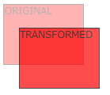
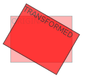
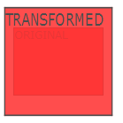
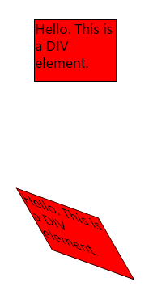
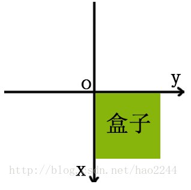
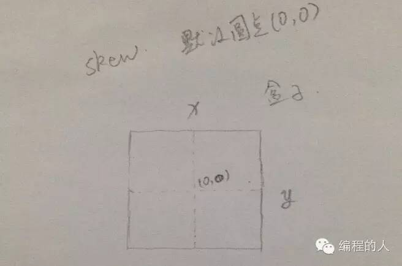
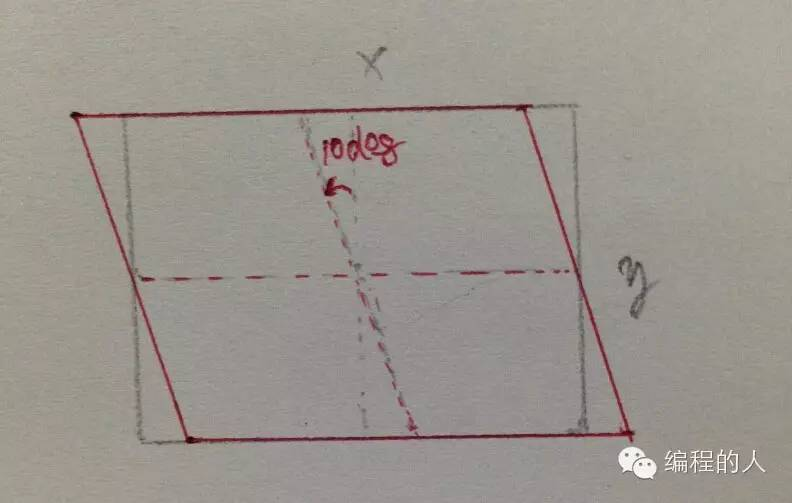
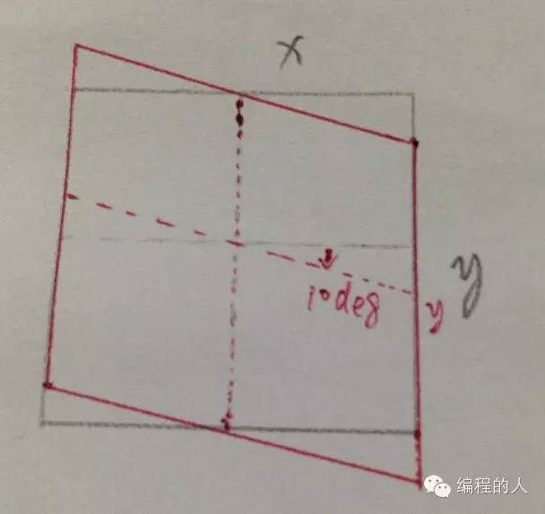
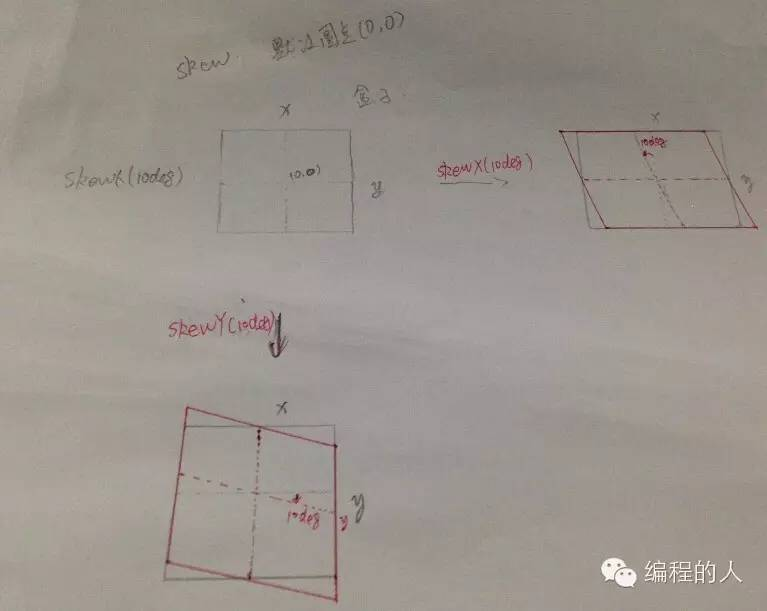

transform（变换）
---
我们可以用这个属性实现平移，旋转，
### 2d转换
- ##### translate 
translate()方法，根据左(X轴)和顶部(Y轴)位置给定的参数，从当前元素位置移动。

```css
div
{
transform: translate(50px,100px);
-ms-transform: translate(50px,100px); /* IE 9 */
-webkit-transform: translate(50px,100px); /* Safari and Chrome */
}
```

和初始位置比较，向右50px,向左100px

- ##### rotate 
rotate()方法，给定一个度数，表示顺时针旋转的角度，可以为负数，则相反

```css
div
{
transform: rotate(30deg);
-ms-transform: rotate(30deg); /* IE 9 */
-webkit-transform: rotate(30deg); /* Safari and Chrome */
}
```

和初始位置比较，顺时针旋转了30度

- ##### scale 
scale()方法，给定两个值，分别表示相对于本身的宽高放大/缩小的倍数，注意这里的本身包含所有情况，文字也算！

```css
div
{
-ms-transform:scale(2,3); /* IE 9 */
-webkit-transform: scale(2,3); /* Safari */
transform: scale(2,3); /* 标准语法 */
}
```

scale（2,3）转变宽度为原来的大小的2倍，和其原始大小3倍的高度。

- ##### skew 
  -  skewX(<angle>);表示只在X轴(水平方向)倾斜。
  - skewY(<angle>);表示只在Y轴(垂直方向)倾斜。

`transform:skew(<angle> [,<angle>]);`
包含两个参数值，分别表示X轴和Y轴倾斜的角度，如果第二个参数为空，则默认为0，参数为负表示向相反方向倾斜。

```css
div
{
transform: skew(30deg,20deg);
-ms-transform: skew(30deg,20deg); /* IE 9 */
-webkit-transform: skew(30deg,20deg); /* Safari and Chrome */
}
```

skew(30deg,20deg) 元素在X轴和Y轴上倾斜20度30度。

#### 补充关于怎么转的
首先说变换的时候坐标系是咋建的，如下图（transform-origin:0px 0px;）

y轴顺时针转为正，X轴逆时针转为正。
图中这个方形是一个BOX,skew的默认原点是盒子的中心点(0,0)横向为Y轴,纵向为X轴,这跟我们以往接触到的坐标轴,刚好是相反的.这个图应该很好理解. 


下面我们来做一个skewX(10deg)的变化.

铅笔盒子,为原盒子.红色的盒子为变换后的盒子.从坐标轴X轴来看,首先将原X轴旋转10个度数,得到红色的X坐标轴,然后根据红色X坐标轴,做盒子的基本变换.这是最进本几何变换了.我们就不深入了,自己可以动手画画图纸,我就喜欢在图纸上理解.

下面继续完成skewY(10deg)的变化.


这里和上面的BOX是一样的,变化的是针对Y轴了.最后得出的是红色BOX.
我附上最后的图纸:


- ##### matrix()方法
matrix()方法把2D变换方法合并成一个。
matrix 方法有六个参数，包含旋转，缩放，移动（平移）和倾斜功能。

`利用matrix()方法旋转div元素30°`
```
div
{
transform:matrix(0.866,0.5,-0.5,0.866,0,0);
-ms-transform:matrix(0.866,0.5,-0.5,0.866,0,0); /* IE 9 */
-webkit-transform:matrix(0.866,0.5,-0.5,0.866,0,0); /* Safari and Chrome */
}
```
matrix(a,b,c,d,e,f)
a：y方向变大多少倍
b:
c:
d:x方向变大多少倍
e,f:e,向X轴方向移动多少；f:向Y轴方向移动多少