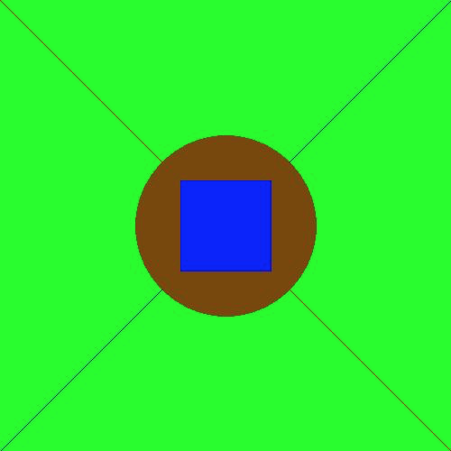
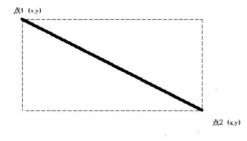
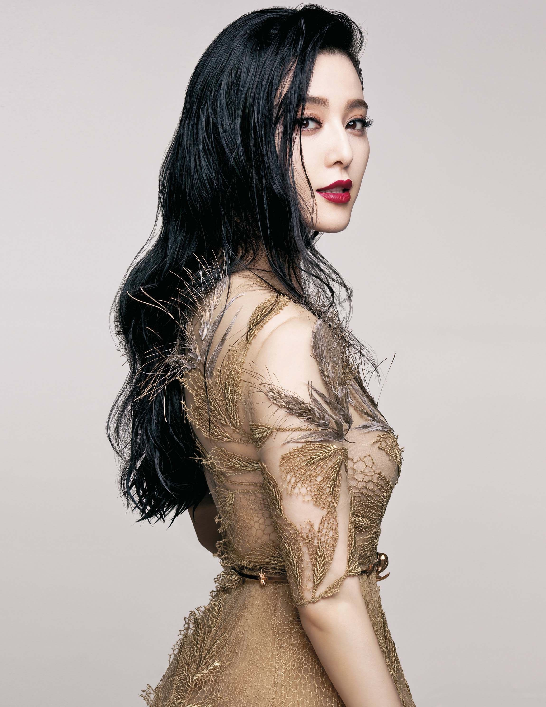
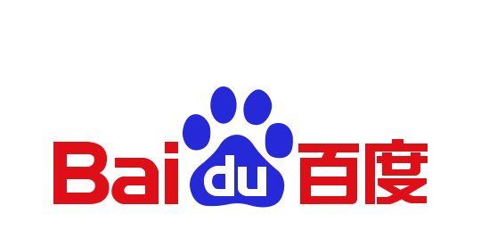
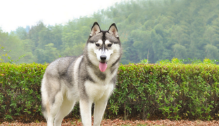
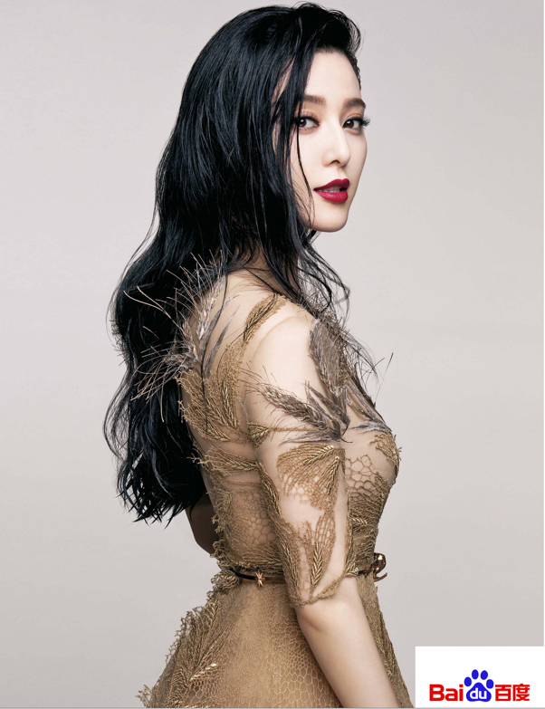
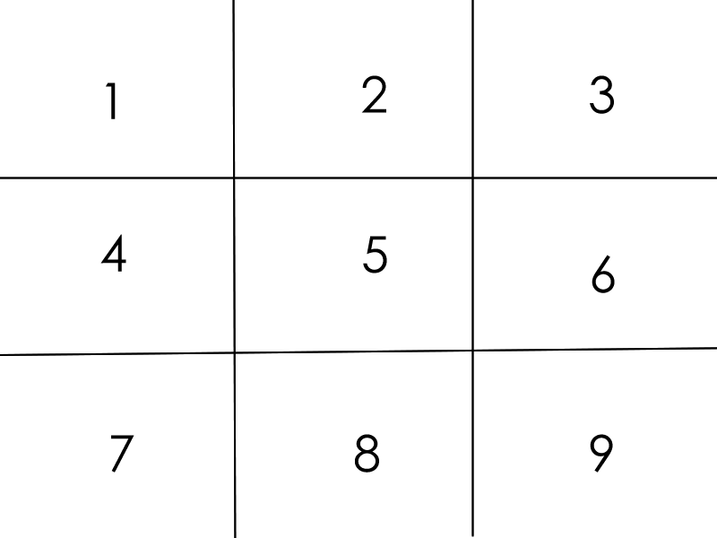

#### 连接地址：http://www.php.cn/course/74.html

第十章 php图像处理
---
#### 1.php图像处理

处理图片的场景很多：
- 生成验证码
- 图片缩放
- 图片水印
- 密保口令卡
- 柱状图

#### 2.php图片处理gd2配置文件处理
学习php图片处理的重点就是学习php的GD系统函数
Php它也可以创建和处理包括 GIF， PNG， JPEG， WBMP 以及 XPM 在内的多种格式的图像。更加方便的是，PHP可以直接将图像数据流输出到浏览器。要想在PHP中使用图像处理功能，你需要连带GD库一起来编译 PHP。GD 库和PHP可能需要其他的库，这取决于你要处理的图像格式。

你可以使用 PHP 中的图像函数来获取下列格式图像的大小： JPEG， GIF， PNG， SWF， TIFF 和 JPEG2000。

查看我们当前的机器是否安装了GD扩展，我们可以写我们第一天学习到的第一句话：

```php
<?php
phpinfo();
?>
```
如果存在了gd这个选项，就说明我们当前机器支持GD来处理图像：
如果没有看到，也没有搜索到。可以按照如下步骤打开gd来处理图像：
- 1.打开php.ini（在文件上传这一章已有说明）
- 2.在 Windows 中，需要将GD2的DLL文件php_gd2.dll作为一个扩展包含在 php.ini 中。修改;extension = php_gd2.dll，将前面的分号去掉

- 3.重新启动apache服务器	
- 4.再次执行phpinfo尝试查看是否存在gd扩展


#### 3.php用图片处理函数画一张图

步骤：
- 画圆
- 准备好了画这张图需要的颜色
- 填充背景颜色
- 画两条对角线
- 在上面画个圆
- 在圆上面画个矩形
- 保存图片
- 销毁图片

一、我们根据这张图推出出来步骤。我们来分析需要使用到的函数：
```php
//使用imagecreate函数创建图片，返回资源
$img = imagecreate(500,500);
```

二、图片创建完成我们需要向图片资源填加颜色，需要使用到函数
```php
$颜色变量 = imagecolorallocate ( resource $图片资源 , int $红 , int $绿 , int $蓝 )
```
红、绿、蓝是计算机里面操作图片的三个基本色。由这三个颜色来组合成我们肉眼所看到的所有颜色。因此 imagecolorallocate 先输入图片资源，操作这个资源。为这个图片资源准备颜色。就相当于在画画的时候，先把画布准备好，再准备颜料。根据这张图，我们需要准备出来的颜色有：绿蓝黑棕。按照计算机的配色原则分配的话，我们下面的颜色分配的代码就要写成下面的样子：

```php
//红
$red = imagecolorallocate($img, 255, 0, 0);
//绿
$green = imagecolorallocate($img, 0, 255, 0);
//蓝
$blue = imagecolorallocate($img, 0, 0, 255);
//棕
$yellow = imagecolorallocate($img, 121, 72, 0);
```


三、 将颜色添加到背景进行填充
```php
imagefilledrectangle ( resource $图片资源 , int $点1x轴, int $点1y轴 , int $点2x轴 , int $点2y轴 , int $color )
```
这个函数需要涉及到几何的一点点知识。
-     1.一个点由x 坐标和y 坐标组成一个点
-     2.两个点可以组成一个直线
-     3.这条线如果不是水平或者垂直的线可以组成一个矩形



点1和点2，可以变成一个矩形。因此，我们输出两个坐标点，可以对画布进行填充。
如果要填充整个画布的话：点1 为x轴为画布的0位置，点1的y轴也为画布的0位置。点2 为x轴为画布的500位置，点2的y轴也为画布的500位置。

四、画两条对角线
画一条对角线，对角线是红色。第一条对角线的坐标为0和0，500和500.第二条对角线的坐标为500和0，0和500

```php
imageline($img, 0, 0, 500, 500, $red);
imageline($img, 500, 0, 0, 500, $blue);
```


五、在上面画一个圆
```php
bool imagefilledellipse ( resource $图片资源 , int $圆心x , int $圆心y , int $圆的宽 , int $圆的高 , int $圆的颜色 )
imagefilledellipse($img, 250, 250, 200, 200, $yellow);
```

操作这个资源，写上圆心的坐标。然后写上长和宽。如果长宽一致为正圆，不一致则为椭圆。

六、在圆上面画一个矩型
```php
imagefilledrectangle($img, 200, 200, 300, 300, $blue);
```

七、保存图片
```php
bool imagejpeg ( resource $image [, string $filename])
```

八、销毁图片资源
```php
imagedestroy($img);
```


全部的代码
```php
<?php
//创建图片
$img = imagecreatetruecolor(500, 500);

//分配颜色
$red = imagecolorallocate($img, 255, 0, 0);

$green = imagecolorallocate($img, 0, 255, 0);

$blue = imagecolorallocate($img, 0, 0, 255);

$pur = imagecolorallocate($img, 255, 0, 255);

$yellow = imagecolorallocate($img, 121, 72, 0);


//填充背景
imagefilledrectangle($img, 0, 0, 500, 500, $green);

//画对角线
imageline($img, 0, 0, 500, 500, $red);
imageline($img, 500, 0, 0, 500, $blue);

//画圆
imagefilledellipse($img, 250, 250, 200, 200, $yellow);

//圆中间画矩形
imagefilledrectangle($img, 200, 200, 300, 300, $blue);


//保存图片，图片名为haha.jpg
imagejpeg($img, 'haha.jpg');

//销毁资源
imagedestroy($img);

?>
```
没出来

#### 4. php开发验证码（生成验证码）
实现过程
- 生成指定宽高的画布
- 准备好了需要生成的字符串
- 每次执行，让代码填充随机的颜色（浅色系）
- 在画布上画上随机的干扰元素（随机点，随机线、随机弧形等均可，但不可过分影响机器视觉）
- 写上四个文字
- 输出header头部，告诉浏览器按照某类型展示
- 输出图像
- 销毁图像资源


第一步、创建画布
```php
$img = imagecreate($width, $height);
```

我们可以定义一个自定义的宽和高。做一个函数将，可以通过函数传入宽和高。这样，可以修改验证码图像的大小。
```php
function check_code($width = 100, $height = 50) {
    $img = imagecreate($width, $height);
}
```

第二步、生成验证码显示的文字
验证码的文字通常有数字、字母。而为了区别验证码字符。我们可以用0-9A-Za-Z。但是0和o，l和I有的时候区分不清楚。我们如果不需要处理，可以想办法去除掉：
方案一：循环4个ascii码，而ascii码，而chr或者sprintf('%c',第二个参数传ascii码) 将对应的字符转为指定的字符。
```php
   for ($i = 0; $i < $num; $i++) {
        $rand = mt_rand(0, 2);
        switch ($rand) {
            case 0:
                $ascii = mt_rand(48, 57); //0-9
                break;
            case 1:
                $ascii = mt_rand(65, 90); //A-Z
                break;
            case 2:
                $ascii = mt_rand(97, 122); //a-z
                break;
        }
        //chr()
        $string .= sprintf('%c', $ascii);
    }
```

方案二：方案一对很多人来说有点复杂，很多人理解不了ascci码。有没有更简单的方案呢。单然有。我可以准备好字符，然后用str_shuffle打乱字符后使用substr进行截取。
```php
//没有0,i,l,o
$str = 'abcdefghijkmnpqrstuvwxyzABCDEFGHJKLMNPQRSTUVWXYZ123456789';
$str = str_shuffle($str);
$string = substr($str,0 ,3);
```


三、 每次执行，让背景填充随机的颜色（浅色系）
文字是深色的看得清楚，而背景是潜色的。背景的RGB颜色表示通常是这样的，RGB颜色是三个色值，这三个色值都是从0-255。而：0-120 低数值是深色系。130 - 255 通常为浅色系。使用到图片颜色的地方挺多的。因此，我可以定义分配颜色的功能：
```php
//浅色的背景函数
function randBg($img) {
    return imagecolorallocate($img, mt_rand(130, 255), mt_rand(130, 255), mt_rand(130, 255));
}
//深色函数，深色的字或者点这些干 扰元素
function randPix($img) {
    return imagecolorallocate($img, mt_rand(0, 120), mt_rand(0, 120), mt_rand(0, 120));
}
```

四、在画布上画上随机的干扰元素
我们可以随机的在图片中画上50个像素点。最小的位置为0，0。最大的位置为最大的宽或者最大的高。然后使用mt_rand(0,最大宽)、mt_rand(0,最大高)。再使用randPix针对我们创建的画布来分配颜色。

```php
   //画干扰元素
    for ($i = 0; $i < 50; $i++) {
        imagesetpixel($img, mt_rand(0, $width), mt_rand(0, $height), randPix($img));
    }
```

五、写上4个文字
$string是一个字符串，字符串$string[0]为字符的第一个字符，依此类类推。因此，我可在使用imagechar函数在图像中写入文字。而写入文字的x,y的坐标我们可以用一个公式推倒出来。X位置 ＝ 图像宽/字符个数(4) * 循环次数。 得到的结果取整后再乘以每次循环的次数。假设图像为100个宽度，那么：第一次写在0的位置，第二次为 25，第三次为50，第四次为75。Y位置 = mt_rand(0,图像高- 15)。我们可以推导出下面的代码，就可以写出对应的文字了：
```php
   for ($i = 0; $i < $num; $i++) {
        $x = floor($width / $num) * $i;
        $y = mt_rand(0, $height - 15);
        imagechar($img, 5, $x, $y, $string[$i], randPix($img));
    }
```

六、输出header头，告知浏览器按照某类型显示
我们知道图像类型的输出函数都有：imagejpeg,imagepng,imagegif等特点。而图像的mime类型为image/jpeg,image/png,image/gif等。因此，我们可以声明一个变量：
- $imagetype = 'jpeg';
- $imagetype = 'png';
- $imagetype = 'gif';

输出header类型的时候执行：`$header = 'Content-type:image/' . $imagetype;`
执行函数输出的可以拼接出一个变量函数：`$func = 'image' . $type;`如果我们的系统支持个类型，则使用function_exists检测函数是否存在。存在则系统支持该类型，不存在则不支持该类型。

```php
   $func = 'image' . $type;
    $header = 'Content-type:image/' . $type;
    if (function_exists($func)) {
        header($header);
        //变为了imagejpeg等
        $func($img);
    } else {
        echo '图片类型不支持';
    }
```

八、销毁资源，返回字符
以后在验证的时候，大家需要把验证码显示出来。并且，用户输出的验证字符还需要与图像中的验证字符匹配。所以要将验证字符返回回来，供以后保存使用。
```php
   imagedestroy($img);
    return $string;
```


我们来看一下全部的准备完成的PHP函数文件，我们将上面的代码封装成一个统一的函数供大家来学习使用：
```php
<?php

check_code();

function check_code($width = 100, $height = 50, $num = 4, $type = 'jpeg') {

   $img = imagecreate($width, $height);
   $string = '';
   for ($i = 0; $i < $num; $i++) {
       $rand = mt_rand(0, 2);
       switch ($rand) {
           case 0:
               $ascii = mt_rand(48, 57); //0-9
               break;
           case 1:
               $ascii = mt_rand(65, 90); //A-Z
               break;

           case 2:
               $ascii = mt_rand(97, 122); //a-z
               break;
       }
       //chr()
       $string .= sprintf('%c', $ascii);

   }
   //背景颜色
   imagefilledrectangle($img, 0, 0, $width, $height, randBg($img));

   //画干扰元素

   for ($i = 0; $i < 50; $i++) {

       imagesetpixel($img, mt_rand(0, $width), mt_rand(0, $height), randPix($img));

   }
   //写字
   for ($i = 0; $i < $num; $i++) {
       $x = floor($width / $num) * $i + 2;
       $y = mt_rand(0, $height - 15);

       imagechar($img, 5, $x, $y, $string[$i], randPix($img));

   }

   //imagejpeg

   $func = 'image' . $type;

   $header = 'Content-type:image/' . $type;

   if (function_exists($func)) {
       header($header);
       $func($img);
   } else {

       echo '图片类型不支持';
   }
   imagedestroy($img);
   return $string;

}
//浅色的背景
function randBg($img) {
   return imagecolorallocate($img, mt_rand(130, 255), mt_rand(130, 255), mt_rand(130, 255));
}
//深色的字或者点这些干 扰元素
function randPix($img) {
   return imagecolorallocate($img, mt_rand(0, 120), mt_rand(0, 120), mt_rand(0, 120));
}

?>
```

#### 5.php图片缩放和裁剪技术
- imagecopyresampled:重采样，拷贝部分图像并调整大小
- imagecopyresized:拷贝部分图片并调整大小	

`bool imagecopyresampled ( resource $目标图 , resource $来源图 , int $目标开始的x位置 , int $目标开始的y位置 , int $来源开始的x位置 , int $来源开始的y位置 , int $目标图片的宽 , int $目标图片的高, int $来源图片的宽 , int $来源图片的高 )`

请注意，上下两个图片的参数都是一样的。
`bool imagecopyresized ( resource $目标图 , resource $来源图 , int $目标开始的x位置 , int $目标开始的y位置 , int $来源开始的x位置 , int $来源开始的y位置 , int $目标图片的宽 , int $目标图片的高, int $来源图片的宽 , int $来源图片的高 )`

图片缩放和裁剪的方法都是一样的，不同的是拷贝时拷贝的是整张图片还是部份部片。

操作方式说明：从来源图片的开始点(x,y)起，指定的宽高的大小图片。放至到目标图片的起点(x,y)，指定宽高大小的图片中。


一、缩放图片，我们将操作步骤化
- 打开来源图片
- 设置图片缩放百分比（缩放）
- 获得来源图片，按比例调整大小
- 新建一个指定大小的图片为目标图
- 将来源图片调整后的大小放到目标中
- 销毁资源


```php
<?php

//打开来源图片
$image = imagecreatefrompng('fbb.png');


//定义百分比，缩放到0.1大小
$percent = 0.1;


// 将图片宽高获取到
list($width, $height) = getimagesize('fbb.png');

//设置新的缩放的宽高
$new_width = $width * $percent;
$new_height = $height * $percent;

//创建新图片
$new_image = imagecreatetruecolor($new_width, $new_height);

//将原图$image按照指定的宽高，复制到$new_image指定的宽高大小中
imagecopyresampled($new_image, $image, 0, 0, 0, 0, $new_width, $new_height, $width, $height);

header('content-type:image/jpeg');
imagejpeg($new_image);
?>
```


二、裁剪图片，我们将操作步骤化：
- 打开来源图片和目标图标
- 截取目标图片中的点，设置宽高，放置到目标图片中。（裁剪）
- 保存图片输入
- 销毁资源

我们将下图中的“度”字裁减出来放至到哈士奇的脸上：



我们来梳理一下思路：度的开始的坐标x,y轴为：407，154，度这个字从x,y坐标开始的宽、高为：80，89，图片中哈士奇脸的位置的x,y轴位置为：281，71，图片中哈士奇脸的x,y坐标宽、高为：132，160，坐标和宽高我们都清楚了我们开始按照函数的用法来，使用代码来操作图片：

```php
<?php
 $dst = imagecreatefrompng('hsq.png');
 $src = imagecreatefrompng('du.png');
 imagecopyresized($dst, $src, 281, 71, 407, 154, 132, 160, 80, 90);
 header('content-type:image/jpeg'); 
imagejpeg($dst); 
imagedestroy($dst);
 imagedestroy($src);
 ?>
```
没有实现~~~

#### 6.php图片水印处理
水印只不过是图片裁剪技术的一点点变形。几何上面的重点知识
- 图片大小
- 图片放在哪个坐标上
- 图片宽高

图片水印技术的核心相当于是两张图片：一张大图；一张小图。将小图放置在大图的某个位置上。水印技术是这个里面最为简单的一个技术，实现方式：
- 1.打开原图（也叫操作的目标图片）
- 2.打开水印图（也叫水印来源图片）
- 3.使用 imagecopymerge 将小图合并至大图的指定位置
- 4.输出图片
- 5销毁资源


一、简单图片水印
需要加水印的目标图片(假设存储在我电脑的d:/www/img/meinv.jpg)，图片如下：


需要加上的logo图片(假设存储在我电脑的d:/www/img/logo.png)，图片如下：


最主要的是要使用这个函数：
```php
bool imagecopymerge ( resource $目标图片 , resource $来源图片, int $目标开始的x , int $目标开始的y, int $来源的x , int $来源的y , int $来源的宽 , int $来源的高 , int $透明度)
```

注意：
透明度的值为0-100的整数。imagecopy和imagecopymerge的区别在于一个有透明度，一个没有透明度。按照总结的步骤，做一个简单的方法：

```php
<?php
//打开目标图片
$dst = imagecreatefrompng('http://img.php.cn/upload/course/000/000/002/5833ebba648cf229.png');

//打开Logo来源图片
$src = imagecreatefrompng('http://img.php.cn/upload/course/000/000/002/5833ebe90cc11285.png');

//得到目标图片的宽高
$dst_info = getimagesize('5833ebba648cf229.png');

//得到logo图片的宽高
$src_info = getimagesize('5833ebe90cc11285.png');

//放到最右下脚可得出图片水印图片需要开始的位置即：
//x点位置：需要大图的宽 - 小图的宽；
//y点位置：放大图的高 - 小图的高

$dst_x = $dst_info[0] - $src_info[0];

$dst_y = $dst_info[1] - $src_info[1];

//要将图片加在右下脚
imagecopymerge($dst, $src, $dst_x, $dst_y, 0, 0, $src_info[0], $src_info[1], 100);

header('Content-type:image/png');
imagepng($dst);

imagedestroy($dst);

imagedestroy($src);

?>
```




二、做一个智能的图片水印函数
一、 我们可以做一个自动化打开图片的函数之前创建图片或者打开图片的函数我们都学习过：
- 1.imagecreate
- 2.imagecreatetruecolor
- 3.imagecreatefromjpeg等

我们来推理下下。我们如果能够想办法得到图片的MIME类型，根据MIME类型找到打开该文件的函数就行了。因此，做这一步分为两块来完成：
- 1.得到文件MIME类型，返回类型。
- 2.传入路径，打开函数，返回资源。

因此，上面两块，我们都可以做成两个函数。传入图片的路径，将图片的宽、高、图片的MIME类型全部返回一个数组，需要的时候使用对应的参数即可。我们可以将mime类型传到到$data当中的type关联数组中。代码如下：
```php
function getImageInfo($path) {
    $info = getimagesize($path);
    $data['width'] = $info[0];
    $data['height'] = $info[1];
    $data['type'] = $info['mime'];
    return $data;
}
```


打开文件的函数，传入一个图片的类型，传入一个图片的路径就打开了图片，返回成了资源类型。下面的例子中，$type使用swithc...case进行判断，如果是imagejpeg就使用imagecreatefromjpeg来打开$path中路径指定的文件。最后，返回一个资源类型。
```php
function openImg($path, $type) {
    switch ($type) {
        case 'image/jpeg':
        case 'image/jpg':
        case 'image/pjpeg':
            $img = imagecreatefromjpeg($path);
            break;
        case 'image/png':
        case 'image/x-png':
            $img = imagecreatefrompng($path);
            break;
        case 'image/gif':
            $img = imagecreatefromgif($path);
            break;
        case 'image/wbmp':
            $img = imagecreatefromwbmp($path);
            break;
        default:
            exit('图片类型不支持');
    }
    return $img;
}
```

自动计算位置：我们可将位置分为10个值，分别为0-9。我们用画图来表示位置：

注：0为随机位置，可出现在页面中的任意处。但是不能超过图片的范围。
0的位置为：
```php
x = 0 至 (大图宽 - 小图宽)
y = 0 至  (大图高 - 小图高)
```
1的位置：
```
x = 0 
y = 0
```
2的位置：
```
x = (大图宽 - 小图宽) /2 
y = 0
```
3的位置：
```
x = 大图宽 - 小图宽
y = 0
```

4的位置：
```
x = 0
y = (大图高 - 小图高) / 2
```
以此类推
我们来推理0-9的实现代码：
```php
 switch($pos){
        case 1:
            $x=0;
            $y=0;
            break;
        case 2:
            $x=ceil(($info['width']-$logo['width'])/2);
            $y=0;
            break;
        case 3:
            $x=$info['width']-$logo['width'];
            $y=0;
            break;
        case 4:
            $x=0;
            $y=ceil(($info['height']-$logo['height'])/2);
            break;
        case 5:
            $x=ceil(($info['width']-$logo['width'])/2);
            $y=ceil(($info['height']-$logo['height'])/2);
            break;
        case 6:
            $x=$info['width']-$logo['width'];
            $y=ceil(($info['height']-$logo['height'])/2);
            break;
        case 7:
            $x=0;
            $y=$info['height']-$logo['height'];
            break;
        case 8:
            $x=ceil(($info['width']-$logo['width'])/2);
            $y=$info['height']-$logo['height'];
            break;
        case 9:
            $x=$info['width']-$logo['width'];
            $y=$info['height']-$logo['height'];
            break;
        case 0:
        default:
            $x=mt_rand(0,$info['width']-$logo['width']);
            $y=mt_rand(0,$y=$info['height']-$logo['height']);
            break;
    }
```

最后调用一下图片的合并、输出和销毁代码即可：
`imagecopymerge($dst,$src,$x,$y,0,0,$logo['width'],$logo['height'],$tm);`


最终效果
```
<?php

water('http://img.php.cn/upload/course/000/000/002/5833ebba648cf229.png','http://img.php.cn/upload/course/000/000/002/5833ebe90cc11285.png',0,50);

function water($img,$water,$pos=9,$tm=100){

   $info=getImageInfo($img);

   $logo=getImageInfo($water);

   $dst=openImg($img,$info['type']);
   $src=openImg($water,$logo['type']);


   switch($pos){
       case 1:
           $x=0;
           $y=0;
           break;
       case 2:
           $x=ceil(($info['width']-$logo['width'])/2);
           $y=0;
           break;
       case 3:
           $x=$info['width']-$logo['width'];
           $y=0;
           break;
       case 4:
           $x=0;
           $y=ceil(($info['height']-$logo['height'])/2);
           break;
       case 5:
           $x=ceil(($info['width']-$logo['width'])/2);
           $y=ceil(($info['height']-$logo['height'])/2);
           break;
       case 6:
           $x=$info['width']-$logo['width'];
           $y=ceil(($info['height']-$logo['height'])/2);
           break;

       case 7:
           $x=0;
           $y=$info['height']-$logo['height'];
           break;
       case 8:
           $x=ceil(($info['width']-$logo['width'])/2);
           $y=$info['height']-$logo['height'];
           break;
       case 9:
           $x=$info['width']-$logo['width'];
           $y=$info['height']-$logo['height'];
           break;
       case 0:
       default:
           $x=mt_rand(0,$info['width']-$logo['width']);
           $y=mt_rand(0,$y=$info['height']-$logo['height']);
           break;

   }
   imagecopymerge($dst,$src,$x,$y,0,0,$logo['width'],$logo['height'],$tm);


   imagejpeg($dst);

   imagedestory($dst);
   imagedestory($src);

}


   function openImg($path,$type){
       switch($type){
           case 'image/jpeg':
           case 'image/jpg':
           case 'image/pjpeg':
               $img=imagecreatefromjpeg($path);
               break;
           case 'image/png':
           case 'image/x-png':
               $img=imagecreatefrompng($path);
               break;
           case 'image/gif':
               $img=imagecreatefromgif($path);
               break;
           case 'image/wbmp':
               $img=imagecreatefromwbmp($path);
               break;
           default:
               exit('图片类型不支持');


       }
       return $img;
   }


?>
```