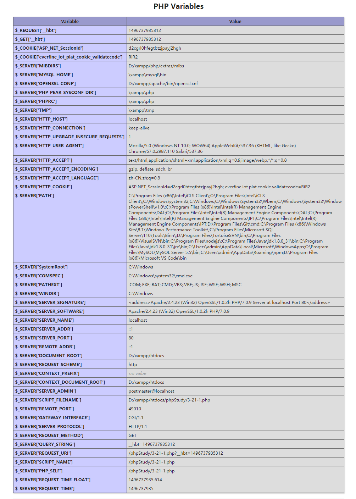

#### 连接地址：http://www.php.cn/course/74.html

第三章php基本语法
---
#### 1.一般用于检测PHP环境是否搭建好
```php
<?php
phpinfo();
?>
```

#### 2.PHP中的变量
- 必须要以$符号开始
- 变量的首字母不能使数字
- 变量的名字区分大小写
- 变量名字不要用特殊字符，不能写中文。可以包含“_"下划线
- 变量名字要有意义

```php
$3name  错误,名字的首字母不能是数字
$a*b    错误，不能包含特殊字符*
$aaaaaa 错误，变量没有意义，并且这么多个a容易数错
$dog 与 $Dog是不同的，因为PHP变量名字区分大小写
$_dog    正确，变量名字的首字母可以是_下划线
```


#### 3.echo：输出、显示功能命令
```php
<?php
$num=12345;
echo $num;
?>
```
#### 3-5.php注释
单行注释：//
多行注释：/**/
```php
<?php
//声明一个变量
$name="黎明";
/*我们要输出这个
变量
*/
echo $name;
?>
```
#### 3-7.php的数据类型-->整型：就是整数，英文：integer，简写int
- 整型分为8   10   16进制
- 32位计算机，也就是32位计算机一次运算处理的最大范围为-2的32次方至232-1
- 8进制声明： 以0开始，后面跟0-7的整数
- 以0x开始，后面跟0-f的，0x的abcdef不区分大小写。

```
<?php
$num=0xab;
echo $num;
//输出171
?>
```
#### 3-8.php数据类型--->	布尔型boolean,两个值：true和false，注意这两个值外面不要加引号
##### 数据类型转换
- 布尔值=false
- 整数值=0
- 浮点数=0.0
- 空字符串
- 没有变量成员的对象
- 变量值为空null

```
$a= false;        //$a设置为假
$b=NULL:        //$b设置为null
$c=NULL;        //$c设置为null
```
除了上述情况以外，其余情况值将会被转换为true，一般来说，1为true，0为false。这些转换将在以后的判断语句中经常遇到。

#### 3-9.数据类型--->字符串** 注意“<?php这个东西中间没空格”**
##### php语言声明字符串的方式（面试经常提问）
- 单引号
- 双引号
- 字界符（需要输入非常大段的字符串的时候使用）

	- ##### 单引号声明
	```
	<?php
	//单引号声明
	$sentence='你好';
	echo $sentence;
	?>
	```
	- ##### 双引号声明
	```
	<?php
	//单引号声明
	$sentence="你好";
	echo $sentence;
	?>
	```
	- ##### 字符界声明
		- 在变量后面的等号，写三个小于号（<<<）
		- 然后在三个小于号后面写上三个字符（建议三个大写英文字母）
		- 然后换行写上任意想写的字符
		- 写完后，顶行，在写上<<<和他后面的三个英文字符再加一个分号
	
	```
	<?php
		$adadf = <<<ABC
			哈哈哈哈哈或或，你好啊
			这个ABC必须顶行，否则出错
	ABC;
		echo $adadf;	
	?>
	```

- ##### 关于单引号和双引号的区别，很重要
	- 双引号解析变量，但是单引号不会解析变量
	- 在单引号里面插入变量，变量后面如果有中文或者英文字符，他会把这个中文或者英文字符拼接起来，视为一整个变量。一定要在变量后面接上特殊字符，例如空格等分开。
	- 如果在双引号里面插入变量的时候不想有空格，可以拿大括号将变量包裹起来。
	- 双引号解析转义字符，单引号不解析转义字符，但是单引号解析\'和\
	- 单引号效率高于双引号，因此尽量使用单引号
	- 双引号和单引号可以互插，双引号里面插入单引号，单引号当中插入变量，这个变量会被解析。
	- 神奇的字符串拼接胶水——> "."点，用来拼接字符串。
	- 我们将定界符声明字符串视为双引号一样的功能来看待。

- ##### 实验举例
	- 双引号解析变量，但是单引号不解析变量

	```
	<?php
		$name='李明';
		$str="我得名字是 $name";
		//注意看$str输出的结果
		echo $str;
		//$str声明的时候用的双引号，所以里面的$name被解析了，变为李明
	    //输出为：  我得名字是 李明
		?>
	```
	如果$str声明的时候，两遍用单引号，看看效果
	```
	<?php
		$name='李明';
		$str='我得名字是 $name';
		//注意看$str输出的结果
		echo $str;
		//$str声明的时候用的双引号，所以里面的$name被解析了，变为李明
	    //输出为：  我得名字是 $name
		?>
	```
通过上面这两个例子，我们看出来，双引号执行变量，而单引号不执行变量。如果为了提高效率，我们一般使用单引号

- 在双引号里面插入变量，变量后面如果有中文或者英文字符，他会把这个字符和变量拼接起来，视为一整个变量。可以在后面接上特殊字符，例如空格分开。

```
<?php
	$name='李明';
	//变量后面跟着中文了，导致str不会输出
	$str="$name哈哈哈哈哈哈";
	echo $str;
	?>
```
页面是空白的，没有输出任何东西
我们在变量的后面加个空格试试
```
<?php
	$name='李明';
	//变量后面加了个空格，然后跟着中文了，那就可以输出了
	$str="$name 哈哈哈哈哈哈";
	echo $str;
	?>
```
我们在改一下，把空格改为!,注意是英文状态下的，否则页面也是空白
```
<?php
	$name='李明';
	//变量后面跟着叹号了，可以输出
	$str="$name!哈哈哈哈哈哈";
	echo $str;
	?>
```
- 如果变量后面不想加特殊字符，那就用大括号把变量包裹起来

```
<?php
	$name='李明';
	//用大括号把空变量包裹起来，导致str不会输出
	$str="{$name}哈哈哈哈哈哈";
	echo $str;
	?>
```

- 双引号解析转义字符，单引号不解析转义字符，但是单引号转义\'和\，可以看看html结构看一下回车还有缩进。注意看例子这是个单引号的输出结果是：丑八怪啊，能不能不打灯打开。\n你好啊，哈哈哈，丑八怪。\t你是最棒的。

```php
<?php
	$str='丑八怪啊，能不能不打灯打开。\n你好啊，哈哈哈，丑八怪。\t你是最棒的。';
	echo $str;
	?>
```

这个是双引号的，转义符被解析了输出结果是：丑八怪啊，能不能不打灯打开。 你好啊，哈哈哈，丑八怪。	你是最棒的。
```
<?php
	$str="丑八怪啊，能不能不打灯打开。\n你好啊，哈哈哈，丑八怪。\t你是最棒的。";
	echo $str;
	?>
```

- 关于转义字符\(反斜杠)
如果我们声明一个变量$beizi，我们想要在$beizi声明的双引号中间加上一个双引号显示输出怎么办？

```
<?php
//要在$beizi的字符串中显示一个双引号怎么办？
$beizi = "多于绝大多数的人出生就是杯具，但是"我们在不断的让人生变为喜剧";

echo $beizi;
?>
```
如果真如上述所写代码，代码会报错。报错结果如下：

因为字符串：“多于绝大多数的人出生就是杯具，但是"我们在不断的让人生变为喜剧”必须写在双引号中间。而双引号中间还有一个双引号。也就是意味着字符串声明提前结束了，在“但是”处结束了。后面"我们在不断的让人生变为喜剧"，电脑不认识。

这真是一个杯具！那么办？
答：我们需要将双引号原有的意义去掉。再双引号前面加上一个\（反斜线，计算机的专业名词叫转义字符），就可以了。

```
<?php

//要在$beizi的字符串中显示一个双引号怎么办？
$beizi = "多于绝大多数的人出生就是杯具，但是\"我们在不断的让人生变为喜剧";

echo $beizi;
?>
```

你可以再执行一下上面的代码，发现不再报错了。同理可推，单引号当中要插入一个单引号显示出来的时候，也可以在单引号声明的字符串中的单引号前面加上(反斜线，转义字符)，将单引号的意义（限定字符区间）去掉。
```
<?php

//要在$beizi的字符串中显示一个双引号怎么办？
$shengyang = 'i\'m xiaoshengyang';

echo  $shengyang;
?>
```

- 双引号和单引号可以互插。双引号中间插入单引号，单引号里面插入变量的时候，变量会被解析。

```
<?php

$legend = '猛虎';

$NoAlike = "心有'$legend',细嗅蔷薇";

echo $NoAlike;

?>
```
执行结果为：心有'猛虎',细嗅蔷薇

- 字符串拼接胶水---> (.)点，用来拼接字符串   

```
<?php
$world1="我";
$world2="爱";
$world3="你";
echo $world1.$world2.$world3;

?>
```

- 我们将定界符号视为双引号功能来看待


```
<?php
$str1='你还有好吃的吗？';
$str2='有就给我点';
$dingjie = <<<AB
我刚才说"$str1",然后\t 啊，
	       $str2
	       \n
	       <h2>哈哈哈哈</h2>
AB;
echo $dingjie;
?>
```
*这个地方不懂，我把AB改为ABC就不好使，报语法错误。*
不知道咋回事，又可以了
~~~
<?php
$str1='你还有好吃的吗？';
$str2='有就给我点';
$dingjie = <<<ABC
我刚才说"$str1",然后\t 啊，
	       $str2
	       \n
	       <h2>哈哈哈哈</h2>
ABC;
echo $dingjie;
?>
~~~

不可见字符：主要是计算机规定的一些特殊符号。例如：回车（\n）、缩进(\t)等。

8.php数据类型--->浮点型：可以理解为我们数学中的小数。
声明方式分为两种：普通声明和科学声明
- 普通声明字符串

```
<?php
$fudian=12.124334;
echo $fudian;
?>
```	
- 科学声明
var_dump() 是一个函数。向括号()中间插入变量。这个函数，会打印出来数据类型，还会对应显示变量的长度和值。
var 是指变量的英文 ： variable
float 读音：[floʊt]
中文解释：计算机中的浮点类型
variable 读音：[ˈveriəbl]
中文解释：变量
dump 读音：[dʌmp]
中文解释：倾倒; 倾销;

```
<?php
$fudian=12.124334;
//输出float(12.124334)
var_dump($fudian);
?>
```
#### 3-11.php流程控制之if else语法（重要，默写级别）
四种基本语法
没有加大括号包裹
```
<?php
if(布尔条件)
   布尔值为真(true)时执行，只能写一行代码;
?>
<?php
if(布尔条件)
   布尔值为真(true)时执行，只能写一行代码;
else
   布尔值为假(false)时执行，只能写一行代码;
?>
```
例子：
```
<?php
	$zhognjiang=true;
	if($zhognjiang)
	echo "恭喜你中奖了";
	else
	echo "很遗憾，你没有中奖";
	?>
```
加入大括号包裹
```
<?php
if(布尔条件){
    布尔值为真(true)时执行，可写多行代码;
}
?>
<?php
if(布尔条件){
    布尔值为真(true)时执行，可写多行代码;
}else{
   布尔值为假(false)时执行，可写多行代码;
}
?>
```
例子：
```
<?php
	$zhognjiang=true;
	if($zhognjiang){
			echo "恭喜你中奖了";	
			echo "你可以拿着这个钱去泡妞了";
	}
	else{
			echo "很遗憾，你没有中奖";	
			echo "哈哈哈，你们有钱去泡妞";
	};
?>
```
擦，注意echo后面加分号，要不就报错

#### 3-12.数据类型--->null
空在英文里面表示是null，它是代表没有。空(null)不是false，不是0，也不是空格。
【重点】知道null产生的三种情况，学习empty 和 isset两个函数的区别。

主要有以下三种情况会产生空类型（null）：
- 通过变量赋值，直接指定变量的值为null
- 一个变量没有给任何值
- 使用函数unset()将变量销毁掉

代码看一遍：
```
<?php
//声明变量为null
$n = null;
var_dump($n);
?>
```
```
<?php
	//没有给任何值
	var_dump($n);
	//直接输出的就是null
?>
```
```
<?php
	//声明一个字符串变量
	$name="limning";
	//unset销毁掉一个变量
	unset($name);
	var_dump($name);
?>
```
另个与null相关的函数（默写级）
。empty()可以向括号里面传入一个变量，这个变量值如果为false，或者null，就会返回true
```
<?php
	$num=null;
	if(empty($num))
	echo"值为真";
	else
	echo"值为假";
	?>
```
。isset()可以向括号里面传入一个或者多个变量。只要有一个变量为null，就会返回false，否则返回true。
```
<?php
	$st=false;
	$ha=isset($st);
	var_dump($ha);
	//这个返回的是bool(true)
	?>
```
我们把$st改为null试试
```
<?php
	$st=null;
	$ha=isset($st);
	var_dump($ha);
	//bool(false)
	?>
```
多个参数的时候,只要有一个为null，那么就返回false
```
<?php
$one = 10;
$two = false;
$three = 0;
$four = null;

$result = isset($one , $two , $three , $four);
//bool(false)
var_dump($result);

?>
```
#### 3-13.数据类型--->数组
数组的英文叫array，var_dump一个变量的时候看到的类型为array的，这个变量就是数组类型
```
<?php
$arr=array(1,2,4);
var_dump($arr);
//返回值为array(3) { [0]=> int(1) [1]=> int(2) [2]=> int(4) }
?>
```

#### 3-14.数据类型之资源类型
资源就是操作我可见可不见得的文件、网络和数据

#### 3-15.数据类型之查看和判断数据类型
**默写级别函数要求**
- 显示类型的函数
- 得到类型的函数
- 判断类型的函数

#### 查看数据类型
- gettype(传入一个变量的值)能够获得变量的类型
```
<?php
$haha=88.8;
echo(gettype($haha));
//double
?>
```
- var_dump(传入一个变量)输出变量类型和值
```php
<?php
$haha=88.8;
echo(var_dump($haha));
?>
//float(88.8) 
```
#### 判断数据类型
我们使用is_*系列的函数，来判断某一个东西是不是某一个类型，如果是这个类型则返回真，不是则返回假
- is_int 是否为整型
- is_bool是否为布尔型
- is_float是否是浮点型
- is_string 是否是字符串
- is_array 是否为数组
- is_object是否是对象
- is_null 是否为空
- is_resource是否为资源
- is_salar 是否为标量	
- is_numeric是否为数值类型
- is_callable 是否为函数


is_types is在前，后面跟类型就可以
变量：整型int，浮点float，布尔bool，字符串string
混合类型：数组array，对象object
特殊类型：空null，资源resource，回调callback
```php
<?php
//is_* 系列函数有个特点，就是如果是这个类型就返回的是真。不是这个数据类型就返回的是假
//声明类型为假
$fo = false;
header("Content-type:text/html;charset=utf-8");
if(is_bool($fo)){
 echo '执行真区间';
}else{
 echo '执行假区间';
}
echo "<br/>";

//检查未声明的变量$p是否为空，为空就执行真区间
if(is_null($p)){
 echo '执行真区间';
}else{
 echo '执行假区间';
}
echo "<br/>";

//字符串类型的数值，看看执行的是真还是假
$str = '18.8';
if(is_numeric($str)){
 echo '执行真区间';
}else{
 echo '执行假区间';
}
echo "<br/>";
//把sca的值换成整型、浮点、布尔和字符串试试
$sca = true;
//如果为标量，执行真区间
if(is_scalar($sca)){
 echo '执行真区间';
}else{
 echo '执行假区间';
}
echo "<br/>";
//换成echo,is_int试试，为什么echo执行假区间呢？
if(is_callable('var_dump')){
 echo '执行真区间';
}else{
 echo '执行假区间';
}
echo "<br/>";
//换成echo,is_int试试，为什么echo执行假区间呢？
if(is_callable("echo")){
	echo'执行真区间';
}else{
	echo'执行假区间';
}
?>
```
#### 3-16. 数据类型之自动转换和强制转换
**默写级别：布尔型的强制转换，强制类型转换的单词**

1. 布尔值的自动类型转换
下面为布尔值判断时的自动类型转换
- 整型integer的0为假，其他的整型值全为真
```php
<?php
header("Content-type:text/html;charset=utf-8");
$integer=1;
//把$integer的值换为0试试
if($integer){
	echo '我是真的';
}else{
	echo "我是假的";
}
?>
```
- 浮点的0.0，布尔值为假，小数点后只要有一个非零的数就为真
```php
<?php
header("Content-type:text/html;charset=utf-8");
//$double改为0.0试试
$double=0.1;
if($double){
	echo"我是真的";
}else{
	echo"我是假的";
}
?>
```

- 空字符串为假，只要里面有一个空格也是真
```php
<?php
header("Content-type:text/html;charset=utf-8");
//$string改为" "试试,里面有空格
$string="";
if($string){
	echo"我是真的";
}else{
	echo"我是假的";
}
?
```

- 字符串的0也将它看为假，其余的为真
```php
<?php
header("Content-type:text/html;charset=utf-8");
$str="0";
//把字符串改为其他值试试
if($str){
	echo "我是真的";
}else{
	echo"我是假的";
}
?>
```
- 空数组也将它视为假，只要里面有一个值，就为真
```php
<?php
header("Content-type:text/html;charset=utf-8");
$arr=array();
//$arr=array(1);试试
if($arr){
	echo"我是真的";
}else{
	echo"我是假的";
}
?>
```
- 空也是假
```php
<?php
header("content-type:text/html;charset=utf-8");
$bool=null;
if($bool){
	echo"我是真的";
}else{
	echo"我是假的";
}
?>
```

- 未成功声明的资源也为假
```php
<?php
//下面这段代码会显示警告，可忽略。暂时只需要对着实验知道效果即可：未声成功的资源也为假
//下面这一块了解意思就行：打开adasfasfasfdsa.txt这个不存在的文件
header("content-type:text/html;charset=utf-8");
$res = fopen('adasfasfasfdsa.txt','r');
if($res){
    echo '美女美女我爱你';
}else{
    echo '凤姐凤姐爱死我，执行假区间咯';
}
?>
```

2. 其他类型的自动类型转换
```
<?php
header("content-type:text/html;charset=utf-8");
//布尔值变整型参与计算
$fo=true;
$result=$fo+10;
//$result最后的值为11，因为$fo布尔的true变为了1
var_dump($result);
echo "<br>";
echo $result;

//字符串类型
$str="520我爱你";
$result=$str+1;
//结果为521。因为将$str变为了整型的520参与运算
//将520放在字符串中间和结尾试试
var_dump($result);

$str1="我爱520你";
$result1=$str1+1;
//结果为1。
var_dump($result1);

$str2="我爱你520";
$result2=$str2+1;
//结果为1
var_dump($result2);
?>
```
**总结**
布尔型的true参与运算，会变成整型或者浮点的1，布尔型的false参与运算会变成整型或者浮点的0，字符串开始是整型的或者浮点类型的字符，会转变成对应的类型参与运算。

3. 强制类型转换有三种方式
- intval()转为整型/floatval()转为浮点型/strval()转为字符串 
```php
<?php
header("content-type:text/html;charset=utf-8");
$float=1.23;
$result=intval($float);
//此时输出的$result为整型的1
var_dump($result);
//$haha整型5
$haha=5;
$re=floatval($haha);
var_dump($re);
//输出的$haha变为浮点型了
//定义整型的变量
$heihei=23;
$bian=strval($heihei);
var_dump($bian);
//变为了字符串
?>
```
- 变量前面加上(),里面写上类型，将它装换后赋值给其他变量
```php
<?php
header("content-type:text/html;charset=utf-8");
$float1=12.44;
//把浮点数变为整型
$result1=(int)$float1;
var_dump($result1);//int(12)
echo("<br>");
//把浮点数变为布尔值
$result=(bool)$float1;
var_dump($result);//bool(true)
echo("<br>");
	
//把浮点变数组
$result3=(array)$float1;
var_dump($result3);	
echo("<br>");
	
//布尔变整型
$bool=true;
$result2=(int)$bool;
var_dump($result2);//int(1)

//其他的也一样
?>
```
- settype(变量，类型)直接改变变量本身
```php
<?php
header("content-type:text/html;charset=utf-8");
//
$fo=12.333;
settype($fo,'int');
var_dump($fo);//int(12)
?>
```
**强制类型转换的特点**
1. 空转为整型会为整型的0
2. 空转为浮点会为浮点的0
3. 空转为字符串会为空字符串""
4. 浮点的123.0转为字符串会为字符串123
5. 浮点的123.2转为字符串会为字符串123.2
6. 浮点即使小数点再大，他都会被干掉，会舍掉小数点后面的值
7. 字符串转为整型的时候，如果数值在前面，会把前面的数值拿出来作为整型的转换值
8. settype(变量，"null"),等价于unset()一个变量
9. $目标变量=（类型）$操作变量，只会改变目标变量的类型，不会改变原变量的类型，settype是改变原值
```php
<?php
      //小可爱，记得自己做实验，验证上面的9点哟
    $t=12.9;
    settype($t,'int');
    var_dump($t);
?>
```

#### 3-17. 对象
- 对象是一个复合型
- 对象的英文名称为object，var_dump一个变量的时候看到的类型为object的时候，这个变量就是对象类型。
- 所谓的复合类型，就是可以在一个类型中存入字符串，浮点型，整型，布尔型等

#### 3-18. php常量和变量之用常量限制用户跳过某些文件。
1. 
- 常量：长久不变的值。
- 常量在代码中的定义、书写方式：define(常量名:常量值)


注意:
- 常量只能是我们讲到的标量。
- 常量名可以小写，但是通常大写
- 常量名可以不加引号，但是通常加上引号
- 在字符串中调用常量的时候必须在字符串外面。
- 常量名建议只用字母和下划线
```php
<?php
header("Content-type:text/html;charset=utf-8");
define('MY_NAME','李明');
echo MY_NAME;
//下面这个是错误的
echo "我的名字是MY_NAME";
echo"<br>";
echo '我的名字是'.MY_NAME;
?>	
```

```php
<?php
header("content-type:text/html;charset=utf-8");
//其实可以大小写，但是不好区分，所以我们一般规定大写
define('xiaoxie',true);
//常量可以在外面不加引号
define(YH,'不要对未来迷惑，迷茫的时候静下心来coding');
echo YH;

//只能用标量，下面这个用来数组，会报错
define('BIAO',array(1,2,3));
?>
```
系统内置的一些擦常量

| 常量名        | 说明   | 
| --------   | -----:  | 
| LINE     | 当前所在的行 |
| FILE        |当前服务器所在的文件路径 | 
| FUNCTION        | 当前函数名 | 
|CLASS|当前类名|
|METHOD|当前成员方法名|
|PHP_OS|PHP运行的操作系统|
|PHP_VERSION|当前PHP的版本|
|TRAIT|Trait的名字，PHP5.4新加|
|DIR|文件所在的目录|
|NAMESPACE|当前命名空间的名称（区分大小写）|

2. define函数来做安全机制
我们来学习这种方法主要是防止别人绕过安全检查文件。
函数：define（常量）
功能：向函数的括号后面传入常量，如果常量定义了就返回true，否则返回false

**情景模拟**
假设我们的这套在线电子商城软件需要付钱，检查是否付费是通过对软件授权检查来完成的，而文件version.php里面就有检查授权的功能，我们在软件中规定，没有授权检查文件version.php就不能使用这个软件。所有的代码都包含了version.php，并且为了防止有人盗版，我们还可以对version.php进行代码加密。

我们有两个文件

- 一个文件中间有版本号，版本声明和授权声明。文件名为version.php
- 一个文件中有具体的业务功能。如用户注册，登陆等。文件名为user.php

我们改怎么做，也就是不包含version.php文件就不让执行user.php后面的代码。

version.php文件
```
<?php

//此处是检查是否是否授权的业务部份代码xxxx
define('AUTH',true);

//略过模拟代码xxx行

?>
```
user.php
```
<?php
//尝试将include 'version.php'这一行代码注释后再执行看看，对比结果
include 'version.php';

if(!defined('AUTH')){
   echo '非法！非法！你尝试跳过授权文件';
   exit;
}


//模拟后面用户注册和用户登陆的代码xxx行
echo '用户注册';
?>
```
实验结果可知：version.php必须包含，不然不会显示后面的echo"用户注册"

#### 3-19. 常量和变量之可变变量。
可变变量--->变量的变量。可变变量其实就是已经声明的变量前，再加上变量符号。
```php
<?php
//定义一个变量叫做$shu,将$shu这个变量的值设为字符串biao
$shu="biao";
//定义一个变量$biao,将他的值设置为字符串鼠标
$biao="鼠标";

//$$shu，就是可变变量：在已声明的变量$shu前面又加了一个变量符号
echo $$shu;
//这时候输出是:鼠标
?>
```
上面代码的过程说明：$shu的值为字符串biao。我在$shu前面又加了一个$,可以理解成下面的变形过程：
$$shu
${$shu}分成两块来看
${'biao'}把$shu变成字符串biao
$biao,而$biao也是一个变量对应的值：鼠标

```php
<?php
$shu="biao";
$biao="wo";
$wo="test";
$test="sina";
$sina="zhongguo";
$zhongguo="china";
$china="我爱你";
//输出test
echo $$$shu;
echo"<br>";
//输出我爱你
echo $$$$$$$shu;
?>
```

#### 3-20. 常量和变量之外部变量。
**外部变量**
php的外部变量是php在使用过程中规定好的一些变量。这个变量的规则就是这么规定的，就这样使用。几个例子
user.html
```html
<!DOCTYPE html>
<html>
	<head>
		<meta charset="UTF-8">
		<title></title>
	</head>
	<body>
		<form action="3-20-reg.php" method="get">
			<input type="text" name="username" />
			<input type="password" name="pwd" />
			<input type="submit" value="提交" />
		</form>
	</body>
</html>

```
我们用get方法将用户名和密码发送给reg.php.
我们得到我们的第一个外部变量$_GET。这个变量的主要作用就是将得到get传过来的值。我们写一个reg.php,用$_GET来接收值。（PHP 的 $_REQUEST 变量包含了 $_GET, $_POST 以及 $_COOKIE 的内容。）
reg.php
```php
<?php
//$_GET后面加上中括号，将username作为字符串放在中括号里面，就得到了表单里面的<input type="text" name="username" /> 的值
$u = $_GET['username'];
echo '账号:'.$u.'<br />';

//$_GET['pwd'] 得到表单<input type="text" name="username" /> 的值
$passwd = $_GET['pwd'];
echo '密码:'.$passwd.'<br />';
?>
```
我们查看此时的地址栏
`http://localhost/phpStudy/3-20-reg.php?username=ddd&pwd=ddd`
由于我们使用的get的方法传值，所以地址栏显示了我们的用户名和密码，到时候我们用post的方式就可以了

我们将上面的代码修改一下，全部使用post传值
user.html
```html
<!DOCTYPE html>
<html>
	<head>
		<meta charset="UTF-8">
		<title></title>
	</head>
	<body>
		<form action="3-20-2-reg.php" method="post">
			<input type="text" name="username" />
			<input type="password" name="pwd" />
			<input type="submit" value="提交" />
		</form>
	</body>
</html>

```
reg.php
```php
<?php
//$_GET后面加上中括号，将username作为字符串放在中括号里面，就得到了表单里面的<input type="text" name="username" /> 的值
$u = $_POST['username'];
echo '账号:'.$u.'<br />';

//$_GET['pwd'] 得到表单<input type="text" name="username" /> 的值
$passwd = $_POST['pwd'];
echo '密码:'.$passwd.'<br />';
?>
```

#### 3-21. 常量和变量之环境变量。
环境变量我们主要用的$_SERVER和$_ENV，后者逐渐被新版本废弃

**重点**
知道在哪查看环境变量的名字（key）和值（value），记住并默写几个常用的环境变量。
查看环境变量
```php
<?php
phpinfo();
?>
```
看下面的图，$_SERVICE[]注意里面的值.

比如我们查看当前文件所在的路径
```
<?php
//我在上图左侧找到的一项，在前面加上了一个$(美元符)，就显示出来了当前文件的路径
echo $_SERVER['SCRIPT_FILENAME'];
?>
```

常用环境变量的键名和键值
| 键名        | 含义   | 
| --------:   | -----:  | 
| $_SERVER["REQUEST_METHOD"]  |  请求当前php页面的方法  |
| $_SERVER["REQUEST_URI"]  |  请求的URI  | 
| $_SERVER["SERVER_SOFTWARE"]  |  用的哪一种服务器  | 
| $_SERVER["REMOTE_ADDR"]  |  客户的IP地址  |
| $_SERVER["SERVER_ADDR"]  |  当前服务器的IP地址  |
| $_SERVER["SCRIPT_FILENAME"]  |  当前请求文件的路径  |
| $_SERVER["HTTP_USER_AGENT"]  |  当前访问这个网址的电脑和浏览器情况   |
| $_SERVER["HTTP_REFERER"]  |  上级来源（用户在那个地址进入的当前网页）  |
| $_SERVER["REQUEST_TIME"]  |  当前的时间  |

URI和URL都是地址，但是URL带有主机地址部分，而URI不带有主机地址部分。例如：
http://www.php.cn/abc.php?username=php 这是一个URL（统一资源定位符），而URI是不带有"http："和主机地址的，本利为
abc.php?username=php


#### 3-22. 常量和变量之变量引用。

比较两段代码
```php
<?php
$fo=5;
$bar=$fo;
$bar=6;
echo $bar."<br>";
echo $fo;
?>
```
注意这里的&符号
```php
<?php
$fo=5;
//变量赋值的时候，可以理解为，把所在的空间也给了他
$bar=&$fo;
$bar=6;
//$fo也变为了6
echo $fo."<br>";
echo $bar
?>
```

#### 3-23. 基础语法之算数运算
| 符号        | 说明   |  举例  |
| --------   | -----:  | :----:  |
| +     | 加 |   $x+$y     |
| -        |   减   |   $x-%y   |
| *        |    乘    |  $x*%y  |
| /      |    除    |  $x/%y  |
| %       |    取模（余数）    |  $x%%y  |


#### 3-24. 基础语法之赋值运算
1. 从上到下依次赋值

```php
<?php

$x = 5;

$x = true;

$x = '爱你';

$x = 12.888;
//最后输出的是12.888
echo $x;
?>
```

| 符号        | 举例   |  等价式子  |
| --------   | -----:  | :----:  |
| +=     | $x+=$y |   $x=$x+$y     |
| -=        |   $x-=$y   |  $x=$x-$y    |
| *=        |    $x*=$y    |  $x=$x*$y   |
| /=      |    $x/=$y    |  $x=$x/$y   |
| %=       |  $x%=$y   |  $x=$x%$y   |
| .=       |    $x.=$y   | $x=$x.$y  |

```php
<?php

$x = 5;

$y = 8;

$x += $y;
//输出13
echo $x;
?>
```
#### 3-25. 基础语法之自加自减
就是把自己加一或者减一

| 符号        | 举例   |  
| --------   | -----:  | 
| $x++    | 先赋值，再加一 |   
| $x--      |  先赋值，再减一 | 
| ++$x      |  先加后赋值 |  
| --$x    |    先减后赋值    | 

```php
<?php
$x=5;
//先赋值，后自己加一，赋值的时候$x=5，所以$y也为5.赋值完了以后，$x自己给自己加1，所以输出的x值为6
$y=$x++;
echo "y的值为:".$y;
echo"x的值为:".$x;
?>
```

#### 3-26. 基础语法之比较运算符
>,<,>=,<=,!=,
- 等于==：值相等
- 全等===：判断类型相等
- 全部等!==：判断类型不等于
```php
<?php
$x = 5;

$y = 6;
//因为5大于6不成立，所以为错的。即为false执行了假区间
if($x > $y){
   //真区间
   echo '变量x 大于 变量y，成立';
}else{
     //假区间
     echo '变量x 大于 变量y，不成立';
}

?>
```
```php
<?php
$x = 5;
$y = '5';
if($x == $y){
   echo '结果为真';
}else{
   echo '结果为假';
}
//输出真，被强制转换了
?>
```
```php
<?php
$x = 5;
$y = '5';
if($x === $y){
   echo '结果为真';
}else{
   echo '结果为假';
}
//值相等，但是类型不相等，所以为假
?>
```


#### 3-27. 基础语法之逻辑运算符
- $x and $y "逻辑与"
- $x && $y
- $x or $y
- $x || $y
- !$x "逻辑非"
- $x xor $y "逻辑异或" 相同取false，相异为true

```php
<?php

$foo = false;

//逻辑非，把false变为了true
if(!$foo){
   echo '执行真区间';
}else{
   echo '执行假区间';
}
//输出真
?>
```
```php
<?php

$x = false;
$y = 2;
if($x & $y++){
   echo '真';
}else{
   echo '假';
}
//输出假，3，也就是$y++执行了
echo $y;
?>
```
```php
<?php

$x = true;
$y = 2;
if($x || $y++){
   echo '真';
}else{
   echo '假';
}
//结果，因为$x已经为true了，肯定执行真区间没有必要执行$y++了，输出真，2
echo $y;
?>
```
```php
<?php

$x = true;
$y = 2;
if($x | $y++){
   echo '真';
}else{
   echo '假';
}
//输出真，3
echo $y;
?>
```

#### 3-28. 基础语法之位运算（基本不用）

#### 3-29. 基础语法之三元运算符及其他运算符
三元运算符相当于if...else..结构

- $x?真代码段：假代码段
```php
<?php
$x = true;
//$x是否为真，真的话$y=5,假的话，$y=6
$x ? $y = 5 : $y = 6;
//输出5
echo  $y;

?>
```

- ``（反引号）：反引号中间插代命令，执行系统命令，等价于shell_exec函数。下面这个例子就是用反引号显示window的IP地址，有些虚拟服务器是禁止执行这些命令的。
```php
<?php
echo '<pre>';

echo `ipconfig`;
echo '</pre>';
?>
```

- @：单行抑制错误，把这一行的错误不让他显示出来(效率低，不建议使用)
```php
<?php
//打开一个不存在的文件adfsafasdfasfasdfdsadf.txt，你运行一下会发现报错了。
//再前面再加上一个@符看看效果
$fp = fopen('adfsafasdfasfasdfdsadf.txt','r');

//@$fp = fopen('adfsafasdfasfasdfdsadf.txt','r');

?>
```

- =>:数组下标访问符
```
<?php

$data = array('sina' =>'新浪' ,'sohu' => '搜狐');

?>php
```

- -=:对象访问符
```php
<?php
//实例化一个对象
$obj = new StdClass();

//判断某对象是某由某个类实例化，如果是的则执行真
if($obj instanceof stdClass){
   echo '真';
}else{
   echo '假';
}
//向obj对象中追加一个成员属性为username
$obj -> username  = 'PHP中文网';

echo $obj -> username;

?>
```
- instanceof:判断某个对象是否来自某个类，如果是返回true，否则返回false