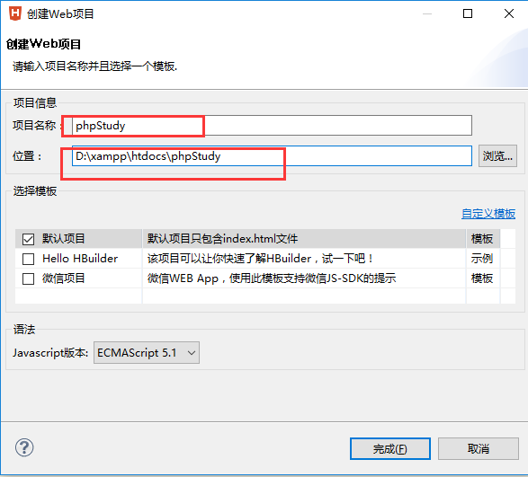
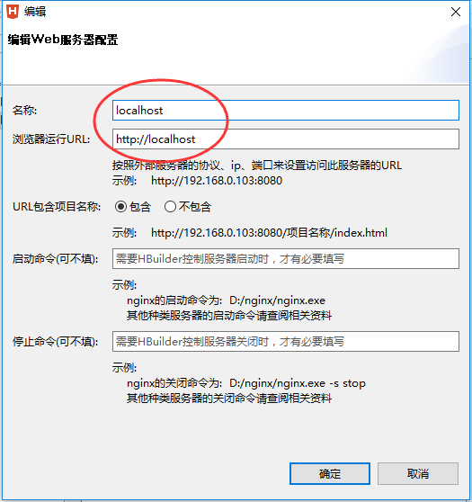
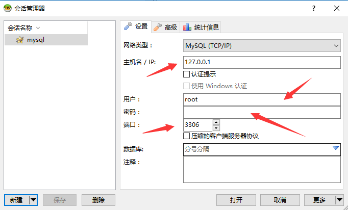

#### 1. xampp

##### 1.1php文件存放位置
默认PHP文件放在xampp\htdocs文件夹下才能运行

##### 1.2修改默认PHP存放位置
- 打开文xampp\apache\conf\httpd.conf
- 查找DocumentRoot，会搜到如下的内容，将目录更改一下就行
	- DocumentRoot "D:/xampp/htdocs"

##### 1.3H-builder搭建开发环境

如果如图一样的写法，最后的路径是这样的：

`D:\xampp\htdocs\phpStudy\phpStudy`



设置外置web服务器


最后测试一下是否搭建好了
```php
<?php
phpInfo();
?>
```

#### 2.HeidiSQL
- 选择：在根分类创建会话

- 如果连接上面的的mysql的话，配置如图，密码为空

